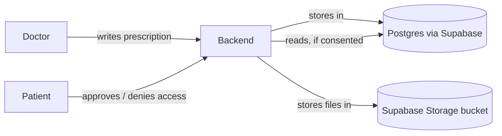
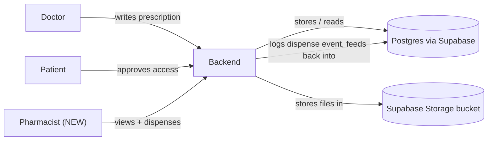

# Lifeline — Pharmacy Tier: Architecture & Flow

Verified directly against the real repo (`ANTOJERRIN/lifeline-backend`,
`backend/app/*`) — module names, table names, and endpoint paths below are
real, not placeholders.

---

## 0. Correction: what Supabase is actually doing here

Supabase is used for exactly two things in this codebase:

1. **Postgres tables** — every `supabase.table("...")` call in `app/*/service.py`.
2. **File storage** — the `medical-reports` bucket, used only in `app/api/upload.py`
   to store the original uploaded PDF/image.

**Supabase Auth is not used anywhere.** Login, password hashing, and tokens are
100% custom: `passlib` (bcrypt) for password hashes and `python-jose` for JWTs,
both in `app/auth/security.py`. There is no `supabase.auth.*` call anywhere in
the codebase. This matters for the integration work: adding a pharmacist does
not touch any Supabase Auth configuration — it's a new value in a plain
Postgres `role` column, checked by the same custom JWT dependency pattern
already in use.

---

## 1. Before — two-tier system

That's the whole shape of it today: doctor and patient both talk to one
FastAPI backend, which reads and writes one Postgres database and one storage
bucket, both via Supabase. Authentication is a JWT the backend itself issues
— Supabase is not involved in that part at all.

---

## 2. Now — three-tier system with pharmacy added

Only one new node: the pharmacist. Everything below the backend line —
Postgres, storage, JWT auth — is exactly the same infrastructure, just
handling one more role and two more tables.

---

## 3. Before vs. now

| Aspect | Before | Now |
|---|---|---|
| Roles | `doctor`, `clerk`, `patient` | + `pharmacist` |
| Auth mechanism | Custom JWT (`app/auth/security.py`), bcrypt password hashing | Unchanged — new role checked the same way |
| Supabase's job | Postgres tables + `medical-reports` storage bucket | Unchanged — two more tables, no new bucket needed |
| Prescription lifecycle | Medicines are just fields inside a `medical_records` row, no status | New `prescribed → dispensed` status, tracked in a new table |
| Access control | `consent_requests` table + `check_doctor_consent()` | Same table and pattern, extended for pharmacist reads |
| Audit trail | `write_access_log()` on every sensitive action | Same function, called from the new pharmacy code too |
| Files touched to add this | — | New `app/pharmacy/` folder + 1 migration file. Two existing files get a small edit: `app/main.py`, `app/auth/security.py` |

---

## 4. Open decisions before building

1. **Consent scope** — one approved consent covers both the doctor and the
   pharmacy, or does the patient approve them separately? (Recommendation:
   reuse `consent_requests`, add a `scope` column so a pharmacy-consent row
   is distinguishable from a doctor-consent row.)
2. **Which pharmacy** — in-hospital only (pharmacist is just a 4th value in
   `users.role`) vs. any external pharmacy (a bigger, multi-tenant change —
   don't build this for the first version).
3. **Inventory/stock** — out of scope unless you explicitly want it. Keep the
   pharmacy tier to "view prescription, mark dispensed" only.
