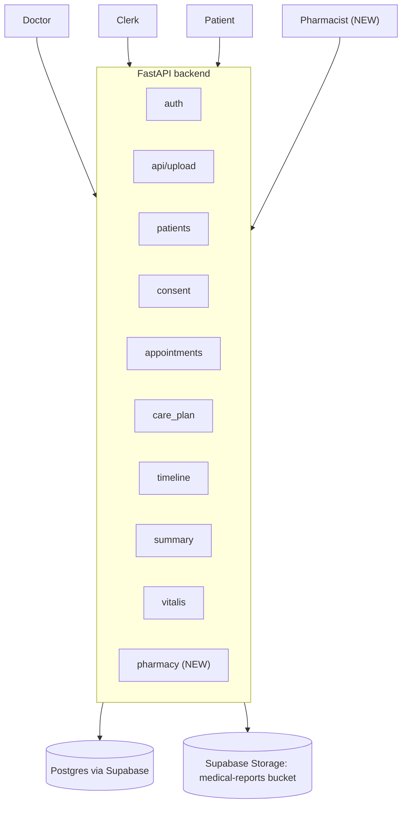

# Lifeline — Total Architecture Reference

One plain diagram, plus the full, verified inventory of what exists in the
repo today (`ANTOJERRIN/lifeline-backend`) and exactly what the pharmacy
tier adds on top of it. No outside research, no extra framing — just the
system as it is.

---

## 1. Total system, one diagram

Everything under "API" is a real folder under `backend/app/`. Auth is a
JWT the backend issues itself — Supabase is the database and file store
only, never the identity provider.

---

## 2. Every module that exists today, and what it does

| Module (`app/...`) | Endpoints | What it does |
|---|---|---|
| `auth` | `POST /register`, `POST /login`, `GET /verify-registration`, `GET /me` | Doctor/clerk registration and login, JWT issue |
| `api/upload.py` | `POST /upload`, `GET /medical-records`, `GET /records/{id}/file` | OCR + AI extraction, saves `medical_records`, uploads original file to storage |
| `patients` | `POST /patients`, `GET /patients/code/{code}`, `GET /patients/{id}`, plus `/patient/request-otp`, `/patient/verify-otp`, `/patient/register`, `/patient/login`, `/patient/profile` (GET/PATCH) | Patient creation by staff, and the patient's own OTP login + profile |
| `consent` | `POST /consent/request`, `GET /consent/pending`, `GET /consent/my-access`, plus 2 more (approve/deny, by-id) | Doctor requests access, patient approves/denies, time-boxed |
| `appointments` | `GET/POST /appointments`, `PATCH/DELETE /appointments/{id}` | Doctor books, either side updates/cancels |
| `care_plan` | `GET /care-plan`, `PATCH /care-plan/{id}` | Follow-up items generated from uploaded records |
| `timeline` | `GET /timeline` | Patient's chronological record view |
| `summary` | `GET /summary` | AI-generated doctor-ready summary of a patient |
| `vitalis` | `POST /vitalis/chat` | Patient-facing AI chat, grounded only in that patient's own records |
| `pharmacy` **(NEW)** | `GET /pharmacy/prescriptions`, `POST /pharmacy/dispense` | Pharmacist views prescriptions and confirms dispensing |

Note: `app/upload/` (a different, older folder) exists in the repo but is
explicitly retired — its own docstring says not to register it. It is not
in the diagram above and should not be touched.

---

## 3. Every table involved, and what's new

| Table | Status | Purpose |
|---|---|---|
| `users` | Existing | Doctor/clerk accounts, `role` column gains `'pharmacist'` |
| `patients` | Existing | Patient identity, `patient_code` (e.g. `LFL-A1B2C3`) |
| `consent_requests` | Existing | Doctor (and now pharmacist) access approval, with expiry |
| `medical_records` | Existing | Diagnosis, medicines, labs — the source of a prescription |
| `appointments` | Existing | Scheduling |
| `access_logs` | Existing | Append-only audit trail for every sensitive action |
| `prescription_status` | **NEW** | One row per medicine batch from a record: `prescribed → sent_to_pharmacy → dispensed` |
| `dispense_events` | **NEW** | Who dispensed what, when, linked back to the prescription |

Six existing tables, unchanged. Two new tables, additive only.

---

## 4. What the pharmacy tier adds, in one sentence each

- One new role (`pharmacist`) checked the same way every other role already is.
- One new module (`app/pharmacy/`) following the exact same routes/service/schemas split as every other module.
- One new auth function (`require_pharmacist`), copied from `require_doctor`.
- Two new tables, both additive, both referencing existing tables by foreign key.
- Zero new infrastructure — same Postgres, same storage bucket, same JWT auth.
